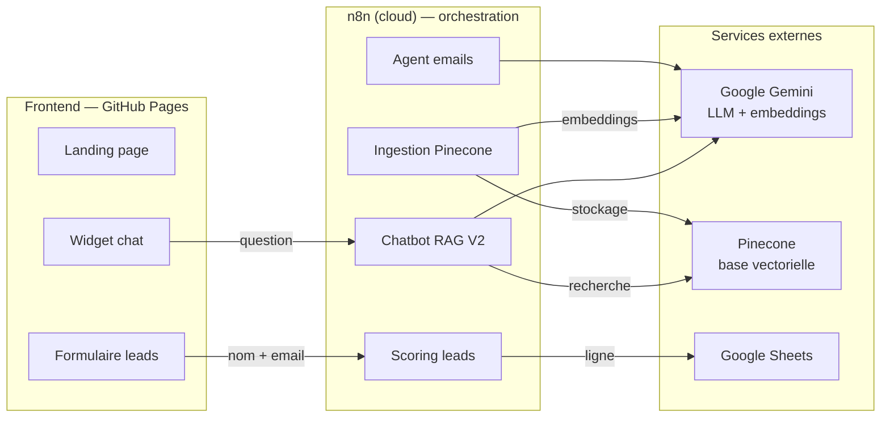

# L'Or & la Cendre — AI Marketing Agency

> Écosystème marketing **100 % automatisé par l'IA générative**, réalisé pour un client fictif :
> **« L'Or & la Cendre »**, maison d'e-commerce de luxe pour hommes (montres d'exception,
> bracelets & accessoires, cigares rares).
>
> Projet de groupe — Master 2 Data Marketing · *LLM · Prompt Engineering · RAG · Agents IA · n8n · Vibe Coding*

🌐 **Site en ligne :** https://nidmhan-hub.github.io/lor-et-la-cendre/

---

## 1. Présentation

« AI Marketing Agency » est une agence fictive spécialisée dans l'automatisation marketing par l'IA.
Ce dépôt regroupe l'écosystème complet livré à son client **L'Or & la Cendre** :

- un **chatbot RAG** de service client, branché sur une base de connaissances vectorielle ;
- un **agent IA** de rédaction d'emails marketing personnalisés ;
- un **workflow d'automatisation** de qualification et scoring des leads ;
- une **landing page** moderne, responsive, intégrant le chatbot et le formulaire de capture.

Promesse de la marque : *« L'art de vivre pour l'homme d'exception »*.

---

## 2. Architecture technique

**Trois couches :** le *frontend* (landing page hébergée) dialogue avec des *workflows n8n*, qui
s'appuient sur des *services externes* (Gemini pour le LLM et les embeddings, Pinecone pour la base
vectorielle, Google Sheets pour le stockage des leads).

---

## 3. Stack technique

| Domaine | Outil |
|---|---|
| Frontend (Vibe Coding) | HTML / CSS / JavaScript — hébergé sur **GitHub Pages** |
| Automatisation | **n8n** (cloud) |
| LLM & embeddings | **Google Gemini** (`gemini-flash` + `gemini-embedding-001`) |
| Base vectorielle (RAG) | **Pinecone** (index dense, 3072 dimensions, cosine) |
| Stockage des leads | **Google Sheets** (API) |
| Prompt engineering | Méthode **CRISCO** (Rôle · Contexte · Objectif · Instructions · Contraintes · Structure) |

---

## 4. Structure du dépôt

| Dossier | Contenu |
|---|---|
| [`landing-page/`](landing-page/) | Le site : `index.html`, styles, JS (widget chat + formulaire leads) |
| [`chatbot-rag-pinecone/`](chatbot-rag-pinecone/) | **Chatbot RAG V2** (embeddings + Pinecone) : workflows d'ingestion et de requête, prompt CRISCO |
| [`chatbot/`](chatbot/) | Chatbot **V1** (injection de contexte) + base de connaissances source |
| [`agent-emails/`](agent-emails/) | Agent IA de rédaction d'emails marketing (workflow + prompt CRISCO) |
| [`lead-scoring/`](lead-scoring/) | Workflow de qualification / scoring des leads + Google Sheets |

Chaque dossier contient son propre `README.md` détaillé (mise en place pas à pas).

---

## 5. Livrables (correspondance avec le brief)

| # | Livrable | Où | État |
|---|---|---|---|
| 3.1 | Chatbot RAG — service client | [`chatbot-rag-pinecone/`](chatbot-rag-pinecone/) | ✅ RAG avec embeddings + vector store Pinecone |
| 3.2 | Agent IA — création de contenu | [`agent-emails/`](agent-emails/) | ✅ Rédaction d'emails personnalisés |
| 3.3 | Workflow n8n — automatisation | [`lead-scoring/`](lead-scoring/) | ✅ Scoring des leads + Google Sheets |
| 3.4 | Landing page — Vibe Coding | [`landing-page/`](landing-page/) | ✅ Responsive, chatbot + formulaire intégrés |
| 3.5 | Documentation & présentation | ce fichier + READMEs | ✅ Architecture, guide, stack |

---

## 6. Guide d'utilisation

### 6.1 Chatbot RAG (V2)
Fonctionne en **deux temps** :
1. **Ingestion** (une fois) : `base-connaissances.md` → découpage → embeddings Gemini → **Pinecone**.
2. **Requête** (à chaque message) : la question est vectorisée → Pinecone renvoie les extraits pertinents → l'agent Gemini rédige la réponse.

Détails et mise en place : [`chatbot-rag-pinecone/README.md`](chatbot-rag-pinecone/README.md).

> **Deux versions comparées :** la **V1** ([`chatbot/`](chatbot/)) injecte toute la base dans le prompt ;
> la **V2** ([`chatbot-rag-pinecone/`](chatbot-rag-pinecone/)) utilise un vrai RAG (embeddings + Pinecone).
> Le site est branché sur la V2.

### 6.2 Agent emails
Un formulaire n8n (type de campagne, univers, segment, prénom) alimente un agent Gemini qui rédige un
email complet (objet, aperçu, corps, CTA) dans la voix de la maison.
Détails : [`agent-emails/README.md`](agent-emails/README.md).

### 6.3 Scoring des leads
Le formulaire « Cercle Privé » de la landing page envoie le lead à n8n, qui calcule un score
(email professionnel, nom complet), le classe (`prioritaire` / `standard`) et l'enregistre dans
Google Sheets. Détails : [`lead-scoring/README.md`](lead-scoring/README.md).

---

## 7. Comment tester

1. **Site :** ouvrir https://nidmhan-hub.github.io/lor-et-la-cendre/
2. **Chatbot :** cliquer la pastille en bas à droite → *« Combien coûte une montre Méridien ? »*
   → réponse « dès 8 900 € », issue de la base vectorielle.
3. **Formulaire leads :** remplir « Rejoindre le Cercle Privé » → une ligne apparaît dans Google Sheets (avec son score).
4. **Agent emails :** ouvrir l'URL du formulaire n8n et générer un email de campagne.

---

## 8. Choix techniques

- **Prompt engineering (CRISCO)** : les prompts du chatbot et de l'agent emails suivent la structure
  Rôle · Contexte · Objectif · Instructions · Contraintes · Structure, pour des réponses cohérentes et maîtrisées.
- **RAG avec vector store** : embeddings `gemini-embedding-001` (3072 dimensions) stockés dans un index
  Pinecone dense (métrique cosine). Le prompt ne contient pas la base : il interroge un **outil de recherche** à la demande.
- **Séparation des responsabilités** : chaque brique est un workflow n8n indépendant, réutilisable et testable isolément.

---

## 9. Auteurs

Projet de groupe — Master 2 Data Marketing, année universitaire 2025-2026.
